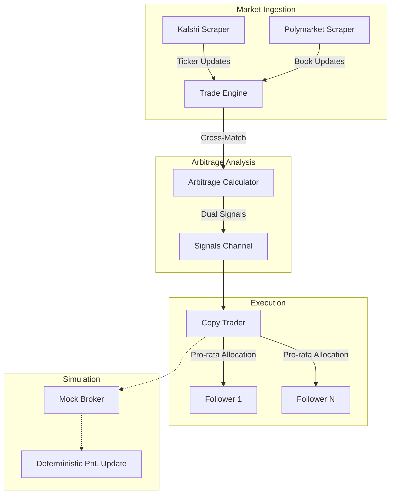

# Predictly — Cross-Exchange Market Scanner

A Go engine that scans prediction market order books across platforms (Kalshi, Polymarket) to identify theoretical mispricings. It ingests real-time WebSocket feeds, evaluates pricing discrepancies, and simulates execution to estimate P&L before any capital is deployed.

## What It Actually Does

- **Cross-Exchange Scanning**: Detects pricing discrepancies where `Price(YES on A) + Price(NO on B) < $1.00`. This indicates a *theoretical* locked-in margin if both legs can be filled at quoted sizes. In practice, liquidity, fees, and fill latency often erode or eliminate the edge.
- **WebSocket Ingestion**: Native scrapers for Kalshi and Polymarket with automatic reconnection, bounded worker pools, and token-bucket rate limiting.
- **Simulated Execution**: Paper-trading mode that tracks hypothetical fills and P&L deterministically. No live trading has been run.
- **Risk Controls**: Position caps, balance-based sizing, and pro-rata allocation logic to model capital constraints realistically.

## Architecture



## Project Structure

```text
arbitrage-platform/
├── cmd/
│   └── server/
│       └── main.go           # Entry point & component wiring
├── internal/
│   ├── domain/               # Core domain models
│   │   ├── market.go         # Contract & signal types
│   │   ├── trade.go          # Allocation & status types
│   │   └── user.go           # Portfolio & risk config
│   ├── market/               # Infrastructure
│   │   ├── scraper.go        # Live WebSocket ingestion
│   │   ├── mock_scraper.go   # Simulated market data
│   │   ├── ev_calculator.go  # Arbitrage logic & math
│   │   └── rate_limiter.go   # Token-bucket implementation
│   └── service/              # Core Services
│       ├── trade_engine.go   # Cross-exchange matching loop
│       ├── copy_trader.go    # Signal broadcasting service
│       └── metrics.go        # Global performance instrumentation
```

## Getting Started

### Local Simulation (Default)
The platform runs in paper-trading mode with generated market data:
```bash
cd arbitrage-platform
go run ./cmd/server
```

### Live Data Ingestion
To connect to real WebSocket feeds (read-only, no execution):
```bash
# PowerShell
$env:USE_LIVE_API="true"
go run ./cmd/server
```

## Risk Management
- **MaxPositionUSD**: Hard cap on notional exposure per follower per trade.
- **RiskFraction**: Percentage of total balance allocated per signal.
- **Pro-Rata Compression**: Scales order sizes down if aggregate demand exceeds modeled liquidity.

## Limitations & Honest Context

- **Simulation only**: No live trades have been executed. Slippage, fees, and API latency are modeled, not measured.
- **Geographic restriction**: Kalshi is unavailable in Ireland, so live testing against real money is not currently possible.
- **Market assumptions**: The `YES + NO < $1.00` condition is necessary but not sufficient for profitable execution. Quote sizes, settlement timing, and platform fees must all be verified per opportunity.

## License
Proprietary Software — All Rights Reserved
