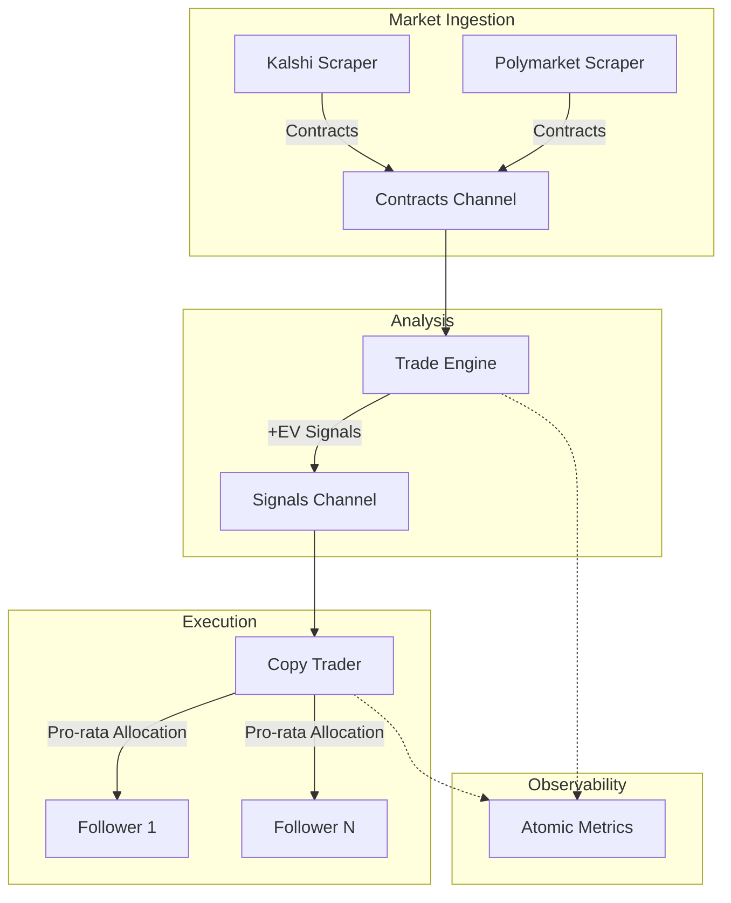

# Arbitrage Platform - Prediction Market Engine

A high-performance Go engine designed for prediction market arbitrage across platforms such as Kalshi and Polymarket. This system provides event-driven market data ingestion, quantitative edge detection through expected value modeling, and a concurrent master-follower execution system for automated copy-trading.

## Key Features

- **High-Throughput Scrapers**: WebSocket-based ingestion for Kalshi and Polymarket utilizing automatic reconnection logic and bounded worker pools for parallel message processing.
- **Quantitative EV Model**: Real-time Expected Value (EV) calculation engine that evaluates exchange odds against proprietary model probability estimates.
- **Copy-Trader Engine**: Concurrent signal broadcasting system featuring a thread-safe user registry and sophisticated pro-rata allocation logic.
- **Resilient Execution**: Integrated token-bucket rate limiting to ensure compliance with exchange API constraints and comprehensive graceful shutdown procedures.
- **Observability**: Atomic global performance counters providing real-time telemetry for signals evaluated, trades executed, and follower fills.
- **Containerized Deployment**: Multi-stage Docker configuration targeting Google's distroless base image for optimized security and minimal runtime footprint.

## Architecture



## Project Structure

```text
arbitrage-platform/
├── cmd/
│   └── server/
│       └── main.go           # Application entry point and component wiring
├── internal/
│   ├── domain/               # Core domain models and business types
│   │   ├── market.go         # Contract and signal definitions
│   │   ├── trade.go          # Allocation and status types
│   │   └── user.go           # Portfolio and risk configuration
│   ├── market/               # Market infrastructure and data ingestion
│   │   ├── scraper.go        # WebSocket ingestion and worker pool management
│   │   ├── ev_calculator.go  # Quantitative expected value model
│   │   └── rate_limiter.go   # Token-bucket rate limiting implementation
│   └── service/              # Core business services
│       ├── trade_engine.go   # Signal analysis and evaluation loop
│       ├── copy_trader.go    # Signal broadcasting and allocation service
│       └── metrics.go        # Global performance instrumentation
├── Dockerfile                # Multi-stage production build configuration
├── go.mod                    # Dependency management
└── go.sum
```

## Getting Started

### Prerequisites
- Go 1.23 or higher
- Docker (optional for containerized execution)

### Local Execution
```bash
cd arbitrage-platform
go mod tidy
go run ./cmd/server
```

### Container Build and Execution
```bash
docker build -t arbitrage-platform .
docker run arbitrage-platform
```

## Risk Management and Compliance
The platform enforces strict risk parameters to protect follower capital:
- **MaxPositionUSD**: Establishes a definitive ceiling for total exposure per follower per individual trade signal.
- **RiskFraction**: Defines the percentage of a user's total balance deployed per signal.
- **Pro-Rata Compression**: Dynamically scales order sizes if cumulative follower demand exceeds available market liquidity, ensuring equitable execution.

## License
Proprietary Software - All Rights Reserved