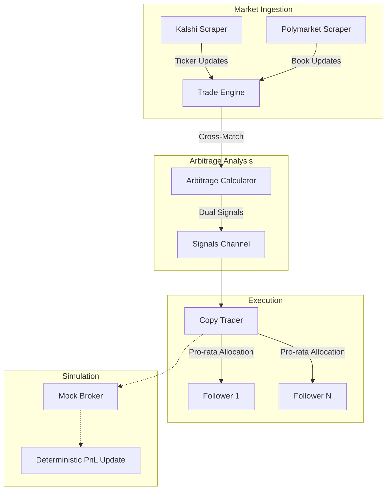

# Predictly - Prediction Market Engine

A high-performance Go engine designed for prediction market arbitrage across platforms such as Kalshi and Polymarket. This system identifies risk-free profit opportunities by comparing real-time order book data across multiple exchanges and executing atomic, cross-platform trades.

## Key Features

- **Cross-Exchange Arbitrage**: Identifies risk-free discrepancies where `Price A (YES) + Price B (NO) < $1.00`. The engine mathematically guarantees profit by matching identical contracts across disparate platforms.
- **High-Throughput Scrapers**: Native WebSocket integration for Kalshi and Polymarket with automatic reconnection logic and bounded worker pools for parallel message parsing.
- **Dual-Leg Execution**: Concurrent signal system that simultaneously executes "YES" and "NO" positions for every follower to lock in arbitrage spreads.
- **Live & Simulation Modes**: Support for high-fidelity simulation (Paper Trading) and live data ingestion via Kalshi Demo and Polymarket CLOB endpoints.
- **Resilient Infrastructure**: Integrated token-bucket rate limiting and thread-safe user registries to protect capital and comply with API constraints.
- **Containerized Deployment**: Multi-stage Docker configuration targeting Google's distroless base image for optimized security and performance.

## Architecture



## Project Structure

```text
arbitrage-platform/
├── cmd/
│   └── server/
│       └── main.go           # Entry point & component wiring
├── internal/
│   ├── domain/               # Core domain models
│   │   ├── market.go         # Contract & signal types
│   │   ├── trade.go          # Allocation & status types
│   │   └── user.go           # Portfolio & risk config
│   ├── market/               # Infrastructure
│   │   ├── scraper.go        # Live WebSocket ingestion
│   │   ├── mock_scraper.go   # Simulated market data
│   │   ├── ev_calculator.go  # Arbitrage logic & math
│   │   └── rate_limiter.go   # Token-bucket implementation
│   └── service/              # Core Services
│       ├── trade_engine.go   # Cross-exchange matching loop
│       ├── copy_trader.go    # Signal broadcasting service
│       └── metrics.go        # Global performance instrumentation
```

## Getting Started

### Local Simulation (Demo)
By default, the platform runs in a high-fidelity simulation mode with generated market data:
```bash
cd arbitrage-platform
go run ./cmd/server
```

### Live Data Mode (Mock Test)
To connect to real WebSocket feeds from Kalshi and Polymarket:
```bash
# PowerShell
$env:USE_LIVE_API="true"
go run ./cmd/server
```

## Risk Management
The platform enforces strict risk parameters to protect follower capital:
- **MaxPositionUSD**: Definitive ceiling for total exposure per follower per trade.
- **RiskFraction**: Percentage of a user's total balance deployed per signal.
- **Pro-Rata Compression**: Dynamically scales order sizes if cumulative demand exceeds available market liquidity.

## License
Proprietary Software - All Rights Reserved
